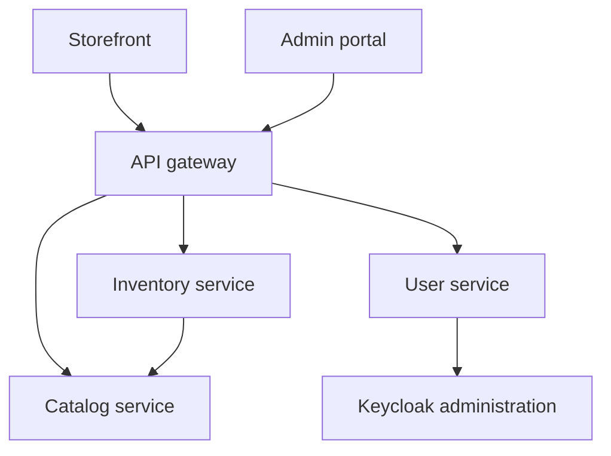

# Architecture

The browser uses each SPA's own OAuth client. During development, Vite forwards `/api` to the gateway. The gateway also allows the two SPA origins for direct browser calls. It routes only named paths and rewrites storefront catalog and profile paths onto the owning service. Domain APIs independently validate the access token and permissions.

Solid arrows identify implemented HTTP route code. Login is browser → Keycloak → SPA callback; the frontend never calls the Admin REST API. Staff administration is admin-web → gateway → user-service → Keycloak Admin REST. Public catalog is storefront-web → gateway → catalog-service. Admin catalog uses the same path under `/api/v1/admin/catalog`. Admin inventory is admin-web → gateway → inventory-service, and setup calls catalog-service with the caller token. Phase 1 evidence: [phase-1.md](phase-1.md). Phase 2 catalog administration: [phase-2.md](phase-2.md). Phase 3 inventory administration: [phase-3.md](phase-3.md). The portal-backend removal is an architecture refactor on top of that completed phase.

Domain services own their invariants and databases. The gateway does not compose responses. A portal backend can be added later when a screen needs data from more than one service. Later, order-service owns the Saga, inventory owns reservations, and payment-service simulates charge/refund outcomes. PostgreSQL and Keycloak do not share an application transaction.

Databases: userdb, catalogdb, inventorydb, cartdb, orderdb, paymentdb, keycloakdb; distinct app roles. A shared local server saves resources but does not confer cross-service query access. Catalog, user-service, and inventory-service connect to their own databases; Keycloak uses keycloakdb. Cart, order, and payment databases remain reserved.

The dev baseline uses HTTP bound to localhost/private Docker network. TLS/mTLS is later work. Redis caches public catalog browse responses. Kafka remains unused infrastructure.
