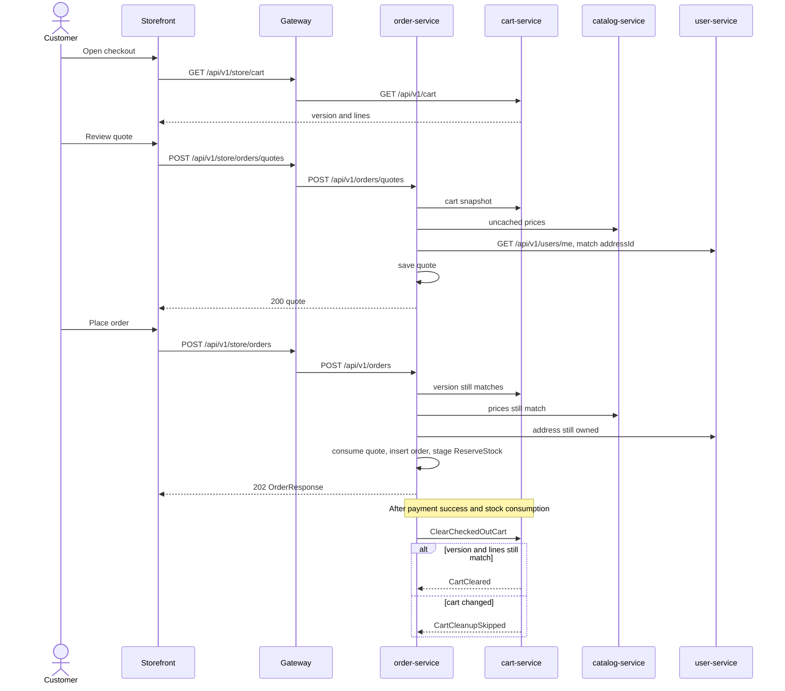

# Cart, quote, and order

The storefront calls the API gateway. The gateway checks the token and rewrites `/api/v1/store/...` onto the owning service. Cart, catalog, addresses, and orders live in separate databases. A quote is the reviewed total stored in `orderdb` before an order exists.

After accept, the saga in [checkout-transitions.md](checkout-transitions.md) reserves stock, charges the local payment simulator, and clears the cart only when the order is confirmed. Topic names are in [checkout-events.md](checkout-events.md). Phase 5 behavior is summarized in [phase-5.md](phase-5.md).

## Why a quote sits between the cart and the order

The cart is a draft. The customer can still change it, catalog prices can change, and the shipping address is chosen at checkout. Those facts are not one row, so order-service cannot convert the live cart into an order inside one transaction.

`POST /api/v1/store/orders/quotes` saves what the customer is about to agree to:

- Cart version, line quantities, and the catalog unit price of each SKU.
- One currency. Mixed currencies are rejected.
- The owned address snapshot.
- Merchandise total, shipping `0.00` (`LOCAL_DEMO_FREE_SHIPPING`), tax `0.00` (`LOCAL_DEMO_TAX_NOT_CALCULATED`), and the grand total. Amounts use scale 2, half up. There is no currency conversion.
- Expiry, 10 minutes by default (`checkout.quote-ttl`).

Quoting does not reserve stock and does not request payment. Accept reads the cart, the uncached catalog batch, and the address again. When the cart version and each unit price still match, the quote is consumed once and those lines and the address are copied onto the order. That copied total is the amount sent to the payment simulator. A later catalog edit does not change the order. A mismatch returns `409` `ORDER_REVIEW_REQUIRED` and creates no order.

## One cart per customer

`cart` is unique on `(owner_issuer, owner_subject)` from the access token. `GET /api/v1/store/cart` creates that row when the customer has none. Placing an order does not insert another cart.

Cleanup runs only after payment has succeeded and stock has been consumed:

- `ClearCheckedOutCart` carries the accepted cart version and the SKU, variant, and quantity set.
- When the current cart still matches, cart-service clears the items on the same row and advances `version`. The next visit uses that empty cart.
- When the customer edited the cart while the saga was running, cleanup is skipped and the newer lines stay. The order stays `CONFIRMED`.
- A rejected checkout, including no stock or a declined payment, does not clear the cart.

## Sequence



The `202` means the order was accepted. It does not mean payment succeeded. The storefront polls `GET /api/v1/store/orders/{id}` until the saga moves the status.

## Calling the APIs

Browser paths below are the gateway contract on port `8090`. Send `Authorization: Bearer <access token>`. order-service and cart-service each validate the token again. Ownership is the token issuer and subject. A foreign quote, order, or address is `404`.

Problem responses use `application/problem+json` with `status`, `title`, `detail`, and `code`. Quote and accept conflicts that need a new quote also include `reason`.

## Cart

Permission `cart.read_own` for read, `cart.write_own` for writes. Gateway paths rewrite to `/api/v1/cart` on cart-service. Full cart rules and the remaining error codes are in [phase-4.md](phase-4.md).

| Method and path | Effect |
|---|---|
| `GET /api/v1/store/cart` | Return the caller's cart. Create an empty cart when none exists. |
| `PUT /api/v1/store/cart/items/{sku}` | Set the absolute quantity of one SKU. |
| `DELETE /api/v1/store/cart/items/{sku}?expectedVersion=` | Remove one line. |
| `DELETE /api/v1/store/cart?expectedVersion=` | Clear every line. |

`PUT` body:

```json
{ "quantity": 1, "expectedVersion": 0 }
```

`quantity` is 1 through 99. It replaces the line quantity. The first write to a missing cart uses `expectedVersion` `0`. Sending the quantity the line already has leaves `version` unchanged. Add and increase call the uncached catalog batch. Remove, a lower quantity, and clear do not. A cart holds at most 100 lines.

`200` body:

```json
{
  "version": 1,
  "items": [
    {
      "catalogVariantId": "2d5b6e0a-1111-2222-3333-444455556666",
      "sku": "KEYBOARD-STD",
      "quantity": 1,
      "displayName": "Keyboard",
      "imageUrl": null,
      "unitPrice": 12.50,
      "currency": "USD",
      "snapshotAt": "2026-10-09T12:00:00Z",
      "lineTotal": 12.50,
      "catalogState": "CONFIRMED",
      "currentUnitPrice": 12.50
    }
  ],
  "subtotals": [{ "currency": "USD", "amount": 12.50 }],
  "catalogRefresh": "FRESH",
  "checkoutNotice": "Prices and stock are validated again at checkout. This cart does not reserve stock."
}
```

`catalogState` is `CONFIRMED`, `UNAVAILABLE`, or `UNKNOWN`. `catalogRefresh` is `FRESH` or `UNKNOWN`. Subtotals are grouped by currency and are not converted. `unitPrice` is the snapshot stored on the line. Checkout prices come from the catalog at quote time, not from this snapshot.

| Condition | Status | Code |
|---|---|---|
| Quantity, SKU, or `expectedVersion` invalid or missing | 400 | `CART_VALIDATION_FAILED` or `CART_MALFORMED_REQUEST` |
| Missing or wrong token | 401 | `CART_AUTHENTICATION_REQUIRED` |
| Missing cart permission | 403 | `CART_ACCESS_DENIED` |
| `expectedVersion` does not match | 409 | `CART_STALE_VERSION` |
| Line missing on delete | 404 | `CART_LINE_NOT_FOUND` |
| More than 100 lines | 409 | `CART_ITEM_LIMIT` |
| SKU is not an active catalog variant on add or increase | 409 | `CART_SKU_UNAVAILABLE` |

A stale version does not change the line.

## Address used by the quote

The quote body takes `addressId`. Addresses are owned by user-service and returned on the caller's profile. There is no separate address-list route.

| Method and path | Permission | Effect |
|---|---|---|
| `GET /api/v1/store/me` | `profile.read_own` | Profile, including `addresses` |
| `POST /api/v1/store/me/addresses` | `profile.update_own` | `201` and the saved address |
| `PUT /api/v1/store/me/addresses/{addressId}` | `profile.update_own` | Replace that address |
| `DELETE /api/v1/store/me/addresses/{addressId}` | `profile.update_own` | `204` |

Create body. `line2` and `region` may be omitted. `countryCode` is two letters.

```json
{
  "label": "Home",
  "line1": "1 Market Street",
  "city": "Karachi",
  "postalCode": "75500",
  "countryCode": "PK"
}
```

`201` body: `id`, `label`, `line1`, `line2`, `city`, `region`, `postalCode`, `countryCode`. Pass `id` as `addressId` on the quote. order-service loads `GET /api/v1/users/me` with the same bearer token and uses the matching address. An id that is not on that profile is `404` `ORDER_NOT_FOUND`.

## Quote

`POST /api/v1/store/orders/quotes` requires `order.create`. The gateway rewrites it to `POST /api/v1/orders/quotes`.

```json
{
  "expectedCartVersion": 1,
  "addressId": "b3ab4b3a-0b1a-4fa1-972d-1a615cb6dc30"
}
```

`expectedCartVersion` is `version` from `GET /api/v1/store/cart`. Both fields are required.

`200` body:

```json
{
  "id": "65cbdd62-104a-4c56-b2b5-9a620a0dd46e",
  "cartVersion": 1,
  "currency": "USD",
  "merchandiseTotal": 12.50,
  "shippingTotal": 0.00,
  "taxTotal": 0.00,
  "grandTotal": 12.50,
  "shippingPolicy": "LOCAL_DEMO_FREE_SHIPPING",
  "taxPolicy": "LOCAL_DEMO_TAX_NOT_CALCULATED",
  "expiresAt": "2026-10-09T12:10:00Z",
  "address": {
    "addressId": "b3ab4b3a-0b1a-4fa1-972d-1a615cb6dc30",
    "label": "Home",
    "line1": "1 Market Street",
    "line2": null,
    "city": "Karachi",
    "region": null,
    "postalCode": "75500",
    "countryCode": "PK"
  },
  "lines": [
    {
      "catalogVariantId": "2d5b6e0a-1111-2222-3333-444455556666",
      "sku": "KEYBOARD-STD",
      "displayName": "Keyboard",
      "quantity": 1,
      "unitPrice": 12.50,
      "lineTotal": 12.50
    }
  ]
}
```

`unitPrice` is the catalog price at quote time. There is no get-quote or list-quotes route. The caller keeps `id` and sends it to accept.

| Condition | Status | Code | `reason` |
|---|---|---|---|
| Cart version differs from `expectedCartVersion` | 409 | `ORDER_REVIEW_REQUIRED` | `CART_CHANGED` |
| Cart has more than one currency | 409 | `ORDER_REVIEW_REQUIRED` | `MIXED_CURRENCY` |
| A line is inactive, missing, or no longer matches the catalog variant | 409 | `ORDER_REVIEW_REQUIRED` | `UNAVAILABLE` |
| Cart has no lines | 422 | `ORDER_VALIDATION_FAILED` | |
| Address is not on the caller's profile | 404 | `ORDER_NOT_FOUND` | |
| Cart, catalog, or user-service is down | 503 | `ORDER_UPSTREAM_UNAVAILABLE` | |
| One of those calls times out | 504 | `ORDER_UPSTREAM_TIMEOUT` | |

Example:

```json
{
  "type": "about:blank",
  "title": "Conflict",
  "status": 409,
  "detail": "The cart changed. Review it and request a new quote",
  "code": "ORDER_REVIEW_REQUIRED",
  "reason": "CART_CHANGED"
}
```

## Accept a quote

`POST /api/v1/store/orders` requires `order.create` and header `Idempotency-Key`.

```http
POST /api/v1/store/orders
Authorization: Bearer <access token>
Idempotency-Key: checkout-43f4b331-9b03-4c24-a58b-d85ef81de75d
Content-Type: application/json

{"quoteId":"65cbdd62-104a-4c56-b2b5-9a620a0dd46e"}
```

The key is 8 to 128 characters from `A-Z`, `a-z`, `0-9`, and `.`, `_`, `:`, `-`. The unique key is owner issuer, owner subject, and this header. The fingerprint is the `quoteId`.

- The same key and the same quote, after the first accept has completed, return the stored status and body. That replay happens before quote expiry and before cart, catalog, or address reads.
- The same key with a different `quoteId` is `409` `ORDER_IDEMPOTENCY_CONFLICT`.
- The same key while the first accept still holds the row is `409` `ORDER_IDEMPOTENCY_IN_PROGRESS` with `Retry-After: 1`.

A successful accept returns `202`, `Location: /api/v1/orders/{id}`, and an `OrderResponse`. The order status is `PENDING_STOCK`, payment status is `NOT_STARTED`, fulfilment status is `NOT_STARTED`, and saga step is `AWAIT_RESERVATION`. `paymentSimulated` is `true`. One transaction writes the order, lines, address snapshot, history, the completed idempotency row, and the `ReserveStock` outbox row. The quote's consumed-order id is set in that same transaction. Kafka being down leaves the order pending.

`OrderResponse` fields: `id`, `orderStatus`, `paymentStatus`, `fulfilmentStatus`, `sagaStep`, `cancellationRequested`, `cleanupStatus`, `obligation`, `currency`, `merchandiseTotal`, `shippingTotal`, `taxTotal`, `grandTotal`, `shippingPolicy`, `taxPolicy`, `paymentSimulated`, `quoteId`, `cartVersion`, `createdAt`, `updatedAt`, `address`, `lines`. Line and address fields match the quote line and address objects above.

| Condition | Status | Code | `reason` |
|---|---|---|---|
| Key missing or the wrong shape, or `quoteId` missing | 400 | `ORDER_VALIDATION_FAILED` or `ORDER_MALFORMED_REQUEST` | |
| Quote missing, or owned by someone else | 404 | `ORDER_NOT_FOUND` | |
| Quote already consumed | 409 | `ORDER_REVIEW_REQUIRED` | `QUOTE_CONSUMED` |
| `expiresAt` has passed | 409 | `ORDER_REVIEW_REQUIRED` | `QUOTE_EXPIRED` |
| Cart version changed since the quote | 409 | `ORDER_REVIEW_REQUIRED` | `CART_CHANGED` |
| A catalog price, currency, variant id, or active line no longer matches the quote | 409 | `ORDER_REVIEW_REQUIRED` | `PRICE_CHANGED` |
| Same key, different quote | 409 | `ORDER_IDEMPOTENCY_CONFLICT` | |
| Same key still in progress | 409 | `ORDER_IDEMPOTENCY_IN_PROGRESS` | |

A `QUOTE_CONSUMED` result that is stored on a completed idempotency row is replayed as that stored body. A new key against an already consumed quote is `ORDER_REVIEW_REQUIRED`.

## Read and cancel

| Method and path | Permission | Effect |
|---|---|---|
| `GET /api/v1/store/orders?page=0&size=20` | `order.read_own` | The caller's orders. `size` is clamped to 1–20. |
| `GET /api/v1/store/orders/{id}` | `order.read_own` | One own order, or `404` `ORDER_NOT_FOUND` |
| `POST /api/v1/store/orders/{id}/cancel` | `order.cancel_own` | Record cancellation intent. `202` and the current `OrderResponse` |

The list body is `{ "items": [ OrderResponse, ... ], "page": 0, "size": 20, "total": 1 }`.

Cancel does not call inventory or payment on the HTTP thread. It sets cancellation on the order when the saga allows it. The following poll shows `CANCEL_PENDING`, then `CANCELLED` or `REJECTED` after compensation. A second cancel of an order that is already cancelling returns the current order. A `REJECTED` order is `409` `ORDER_NOT_CANCELLABLE`.

`orderStatus` values: `PENDING_STOCK`, `PENDING_HOLD`, `PENDING_PAYMENT`, `PENDING_CONSUMPTION`, `CONFIRMED`, `COMPENSATING`, `CANCEL_PENDING`, `REJECTED`, `CANCELLED`, `MANUAL_REVIEW`.

`paymentStatus` values: `NOT_STARTED`, `REQUESTED`, `SUCCEEDED`, `DECLINED`, `UNKNOWN`, `REFUND_REQUESTED`, `REFUNDED`, `REFUND_FAILED`.

`fulfilmentStatus` is `NOT_STARTED` in this phase. `cleanupStatus` is `NOT_STARTED`, `REQUESTED`, `CLEARED`, `SKIPPED`, or `UNCONFIRMED`. `obligation` is empty while automation can still finish the step. `MANUAL_REVIEW` puts the outstanding obligation in that field. What each status does next is [checkout-transitions.md](checkout-transitions.md).
