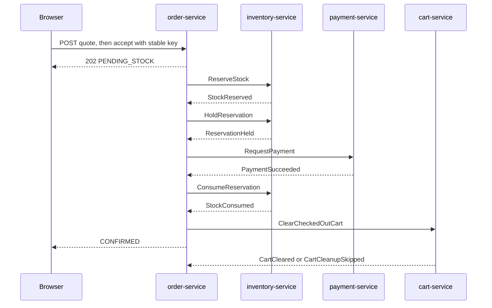

# Phase 5 — Durable checkout Saga

Phase 5 adds server-owned quotes, asynchronous order acceptance, inventory reservations, a local payment simulator, compensation, and safe cart cleanup. The browser path remains storefront-web → API gateway → order-service. Kafka carries durable participant commands and outcomes. PostgreSQL remains authoritative in every service.

## Customer API

| Gateway contract | Permission | Behavior |
|---|---|---|
| `POST /api/v1/store/orders/quotes` | `order.create` | Validate owned cart/address and current uncached catalog data; persist a ten-minute quote |
| `POST /api/v1/store/orders` | `order.create` | Accept a quote under `Idempotency-Key`; return `202` and start the Saga |
| `GET /api/v1/store/orders` | `order.read_own` | Bounded list for the token issuer and subject |
| `GET /api/v1/store/orders/{id}` | `order.read_own` | Own order progress; a foreign id is `404` |
| `POST /api/v1/store/orders/{id}/cancel` | `order.cancel_own` | Record cancellation intent and return `202` |

order-service independently validates issuer, signature, expiry, bearer type, audience `order-service`, and only roles under the `order-service` client. The gateway forwards the bearer for pre-acceptance own-cart and own-address reads. It does not persist the token, publish it to Kafka, compose an order, or decide a state transition.

Quote request:

```json
{
  "expectedCartVersion": 4,
  "addressId": "b3ab4b3a-0b1a-4fa1-972d-1a615cb6dc30"
}
```

Accept request:

```http
POST /api/v1/store/orders
Idempotency-Key: checkout-43f4b331-9b03-4c24-a58b-d85ef81de75d
Content-Type: application/json

{"quoteId":"65cbdd62-104a-4c56-b2b5-9a620a0dd46e"}
```

The key is 8–128 characters from `A-Za-z0-9._:-`. A completed same-key/same-quote retry returns the stored response before checking quote expiry or calling another service. The same key with another quote is `409 ORDER_IDEMPOTENCY_CONFLICT`. One transaction consumes the quote, inserts the order, immutable lines/address, history, completed idempotency response, and `ReserveStock` outbox row. Kafka being unavailable therefore leaves a visible pending order.

## Quote policy

Quote creation and final acceptance read the current cart version, the customer's saved address, and uncached catalog batch data. A changed cart, inactive item, changed price/currency, used quote, or expired quote returns `409 ORDER_REVIEW_REQUIRED` and requires a new quote. Multi-currency carts return reason `MIXED_CURRENCY`.

Money uses scale two and `HALF_UP`. Shipping and tax are intentionally zero in this local phase and are labeled `LOCAL_DEMO_FREE_SHIPPING` and `LOCAL_DEMO_TAX_NOT_CALCULATED`. There is no currency conversion. Quoting does not reserve stock or request payment.

## Happy path



The order is `CONFIRMED` only after charge success and stock consumption. Fulfilment stays `NOT_STARTED`; process, dispatch, and delivery are Phase 6. Cart cleanup is independent. A customer edit makes cleanup skip safely rather than deleting new contents.

The cart, quote, and order HTTP flow, including request and response bodies, is [cart-quote-order.md](cart-quote-order.md). The complete transition and compensation table is [checkout-transitions.md](checkout-transitions.md). Topic and envelope contracts are [checkout-events.md](checkout-events.md). The persistence and recovery decision is [ADR 0003](adr/0003-checkout-orchestration-and-transactional-messaging.md).

## Inventory lifecycle

Inventory locks stock rows in catalog variant id order and reserves every requested line or none. Available stock is `onHand - reserved`; database checks retain `onHand >= reserved >= 0`. States are `ACTIVE`, `CHECKOUT_HELD`, `CONSUMED`, `RELEASED`, and `RESTOCKED`.

`ACTIVE` has a two-minute pre-payment TTL. order-service cannot request payment until `ReservationHeld` moves it to `CHECKOUT_HELD`. The expiry worker never frees held stock. Release leaves `onHand` unchanged. Consume decreases `onHand` and `reserved` once. Restock after a consumed cancellation increases `onHand` once. Consume/restock are immutable `stock_movement` rows, distinct from admin adjustments. An early release creates a tombstone so a delayed reserve cannot recreate cancelled stock.

## Payment simulator

payment-service runs on 8098 and is not routed through the gateway. It owns `paymentdb` / `payment_app`. No card fields, provider calls, or real money exist. Trusted Kafka commands create durable charge and refund attempts.

Scenarios are `SUCCESS`, `DECLINE`, `DELAYED_SUCCESS`, `TIMEOUT`, and `LATE_SUCCESS`; refunds are `SUCCESS` or `REFUND_FAILURE`. Delayed effects use persisted `simulator_due` rows and a poller, not an in-memory timer. A timeout creates `UNKNOWN`; order-service queries the original operation id. Automation is bounded at eight attempts before `MANUAL_REVIEW`.

The local control endpoint is disabled by default, never routed by the gateway, and returns `404` unless `PAYMENT_SIMULATOR_CONTROL_ENABLED=true` and `X-Simulator-Control` matches `PAYMENT_SIMULATOR_CONTROL_TOKEN`. It changes future attempts only. `make saga-check` restores `SUCCESS` / `SUCCESS` on exit.

## Compensation and cancellation

- Stock rejection creates no charge and rejects the order.
- Payment decline releases the held reservation before the order becomes `REJECTED`.
- Payment success followed by consume failure requests a refund and safe reservation cleanup.
- Cancellation while payment is running becomes `CANCEL_PENDING`; a late success creates a refund obligation.
- Cancelling a confirmed, unfulfilled order refunds and restocks. `CANCELLED` is set only after both acknowledgements.
- A late charge after rejection does not resurrect the order; it starts refund compensation.
- Exhausted unknown payment or failed compensation remains `MANUAL_REVIEW` with its obligation visible.

## Storefront

Checkout loads the customer's cart and saved addresses. A customer can save the first address, request a quote, inspect amount/currency/expiry/policies, and accept it. The idempotency key is kept in session storage for that quote and reused after an uncertain network result. A review-required response discards the key and quote.

Order detail displays pending stock, hold, payment, consumption, compensation, cancellation, rejection, and manual-review states. It labels payment as simulated and polls every two seconds for at most 40 reads. Unmount and account changes cancel the timer. There is no paid toggle.

## Running and checks

Source services use Kafka at `localhost:59092`. Compose services use `kafka:9092`.

```bash
# Infrastructure and source-run services
make infra-up
bash scripts/local/compose.sh --profile cache --profile events up -d redis kafka
make run-service SERVICE=user-service
make run-service SERVICE=catalog-service
make run-service SERVICE=inventory-service
make run-service SERVICE=cart-service
make run-service SERVICE=order-service
make run-service SERVICE=payment-service
make run-service SERVICE=api-gateway

# Happy path, ownership, idempotency, and final stock/payment state
make checkout-check
```

For deterministic decline/refund checks, use a local random token without printing or committing it:

```bash
export PAYMENT_SIMULATOR_CONTROL_ENABLED=true
export PAYMENT_SIMULATOR_CONTROL_TOKEN="$(openssl rand -hex 32)"
# Restart payment-service with those variables, then:
make saga-check
```

Container mode requires `apps`, `cache`, and `events`. `make checkout-debug-up` adds the debug override for payment port 8098 when running `saga-check`.

## Recovery and trust limits

Outbox immediate dispatch lowers latency; polling and expired-lease claims provide restart recovery. A broker acknowledgement can still be followed by a duplicate if the process crashes before the PostgreSQL row is marked sent. Inbox and stable command identities prevent a second business effect.

Local Kafka is PLAINTEXT. `eventId`, `correlationId`, and other envelope fields do not authenticate a producer. This phase does not claim production broker ACLs/TLS, operational alerting, or full observability. Those remain Phase 7.

## Verification status

The commands and actual results are recorded in [verification.md](verification.md). Phase 5 is complete only when backend verification, both frontend gates, `checkout-check`, `saga-check`, and the browser scenarios have passed. No Phase 6 fulfilment action is implemented.
