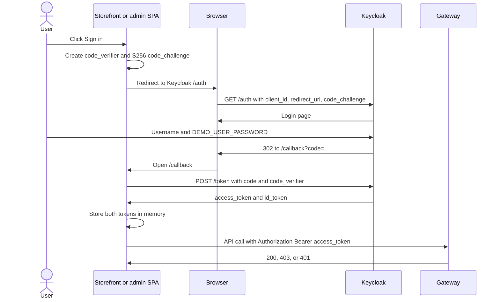
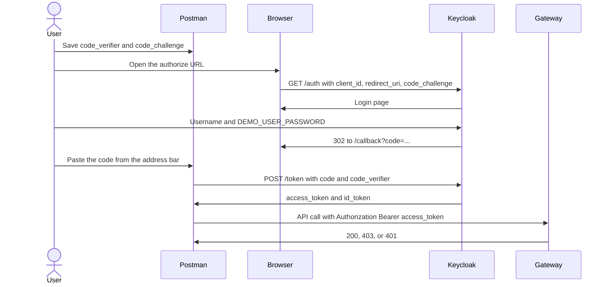

# Get a user access token and call the API from Postman

A person does not send a username and password to the API. They sign in on Keycloak's login page. Keycloak returns a short-lived **access token**. Postman sends that token as `Authorization: Bearer <access_token>`.

Password grant is disabled on both SPA clients. Do not use the Keycloak console password (`KEYCLOAK_ADMIN_PASSWORD`) as an API token. Seed users and their roles are in [seed-users.md](seed-users.md). The shared password is `DEMO_USER_PASSWORD` in the git-ignored root `.env`.

## Before you start

From the repository root in WSL2:

```bash
bash infrastructure/local/manual-startup/infra.sh up
make run-service SERVICE=user-service
make run-service SERVICE=catalog-service
make run-service SERVICE=api-gateway
```

| Piece | Address |
|---|---|
| Keycloak realm | `http://localhost:8180/realms/ecommerce-local` |
| Authorize | `http://localhost:8180/realms/ecommerce-local/protocol/openid-connect/auth` |
| Token | `http://localhost:8180/realms/ecommerce-local/protocol/openid-connect/token` |
| API gateway | `http://localhost:8090` |

Call the gateway, not user-service directly. The gateway checks audience `api-gateway`, then user-service and catalog-service check their own audiences. Use the **access token** (`typ=Bearer`). The ID token is rejected. On a realm imported before the portal backends were removed, run `make realm-migrate-portals` and sign in again.

| Kind of user | Client id | Redirect URI Keycloak accepts | Example username |
|---|---|---|---|
| Normal customer | `storefront-spa` | `http://localhost:5173/callback` | `customer@example.test` |
| Staff / admin | `admin-spa` | `http://localhost:5174/callback` | `user-admin@example.test` |

Both clients are public (no client secret) and require PKCE S256. Postman's default callback `https://oauth.pstmn.io/v1/callback` is not registered, so the Postman "Get New Access Token" button fails until you follow the manual steps below.

A storefront login only puts `CUSTOMER` permissions in the token. Staff permissions are issued only by `admin-spa`. `customer@example.test` therefore gets **403** on `/api/v1/admin/users` and `/api/v1/admin/roles`.

## Browser login

Use this when you click **Sign in** in the running app. Storefront is http://localhost:5173 (`storefront-spa`). Admin is http://localhost:5174 (`admin-spa`). The SPA must be running. It creates the PKCE pair, exchanges the code on `/callback`, and keeps the access token in memory. You never copy the code.



Storefront then calls `GET /api/v1/store/me`. Admin calls `/api/v1/admin/users` and `/api/v1/admin/roles` only when the token includes those permissions. Reload the page and the in-memory token is gone; sign in again.

## Postman login

Use this when Postman calls the API. Stop the Vite app on the callback port first (5173 for a customer, 5174 for an admin). If that app is running, it exchanges the code itself and Postman's token request fails. You create the PKCE pair, sign in in the browser, copy `code` from the address bar, and Postman exchanges it.



`bash scripts/local/oidc-login.sh <client> <username>` performs this Postman exchange for you and prints the token JSON. The steps below are the same requests entered by hand.

Access tokens last about 300 seconds. After a role change, sign in again. An already issued token keeps its old roles until it expires.

## Postman: customer token

Stop the storefront Vite app (port 5173) before this. If it is running, it consumes the `code` and the token request fails.

### 1. Create a PKCE pair

In WSL2:

```bash
verifier="$(openssl rand 32 | openssl base64 -A | tr '+/' '-_' | tr -d '=')"
challenge="$(printf '%s' "$verifier" | openssl dgst -sha256 -binary | openssl base64 -A | tr '+/' '-_' | tr -d '=')"
printf 'verifier=%s\nchallenge=%s\n' "$verifier" "$challenge"
```

In Postman, create an environment `local` and save `code_verifier` and `code_challenge` from that output. Leave `code` and `access_token` empty for now.

### 2. Open the login page

Paste this into a browser. Replace `CHALLENGE` with `code_challenge`. The `state` value can be any short random string; it must come back unchanged.

```text
http://localhost:8180/realms/ecommerce-local/protocol/openid-connect/auth?client_id=storefront-spa&response_type=code&redirect_uri=http%3A%2F%2Flocalhost%3A5173%2Fcallback&scope=openid&state=postman1&code_challenge=CHALLENGE&code_challenge_method=S256
```

Sign in as `customer@example.test`. The password is `DEMO_USER_PASSWORD` from `.env` (`grep '^DEMO_USER_PASSWORD=' .env`).

The browser is redirected to a URL like:

```text
http://localhost:5173/callback?state=postman1&session_state=...&code=PASTE_THIS
```

The page can show "connection refused". Copy only the `code` query value into the Postman variable `code`. If the page shows an error from Keycloak instead of a `code`, the challenge or redirect URI does not match step 1.

### 3. Exchange the code

Create a Postman request:

| Field | Value |
|---|---|
| Method | `POST` |
| URL | `http://localhost:8180/realms/ecommerce-local/protocol/openid-connect/token` |
| Body | `x-www-form-urlencoded` |

| Key | Value |
|---|---|
| `grant_type` | `authorization_code` |
| `client_id` | `storefront-spa` |
| `code` | `{{code}}` |
| `redirect_uri` | `http://localhost:5173/callback` |
| `code_verifier` | `{{code_verifier}}` |

Send. The JSON contains `access_token`, `id_token`, and `expires_in`. Copy `access_token` into `{{access_token}}`. Do not send `id_token` to the API.

A code works once. If this returns `invalid_grant`, repeat from step 1.

### 4. Call the customer API

New request:

| Field | Value |
|---|---|
| Method | `GET` |
| URL | `http://localhost:8090/api/v1/store/me` |
| Authorization | Bearer Token, token `{{access_token}}` |

Send. A new customer gets **200** and a profile id. No token is **401**. This same token on `GET http://localhost:8090/api/v1/admin/users` is **403**.

## Postman: admin token

Repeat the same three steps with the admin client. Stop the admin Vite app on port 5174 so it does not consume the code.

Authorize URL (replace `CHALLENGE`):

```text
http://localhost:8180/realms/ecommerce-local/protocol/openid-connect/auth?client_id=admin-spa&response_type=code&redirect_uri=http%3A%2F%2Flocalhost%3A5174%2Fcallback&scope=openid&state=postman1&code_challenge=CHALLENGE&code_challenge_method=S256
```

Sign in as `user-admin@example.test` (or `platform-admin@example.test` when you need `POST /api/v1/admin/roles`).

Token body:

| Key | Value |
|---|---|
| `grant_type` | `authorization_code` |
| `client_id` | `admin-spa` |
| `code` | the `code` from `http://localhost:5174/callback?...` |
| `redirect_uri` | `http://localhost:5174/callback` |
| `code_verifier` | the verifier that matches this challenge |

Save that `access_token` as `{{admin_token}}`. It is a different token from the customer one.

## Postman: admin user and role APIs

Collection authorization: Bearer Token `{{admin_token}}`. Every write except creating a role bundle needs a new `Idempotency-Key` header. A successful write is **200**. A write still finishing in Keycloak is **202**; `GET /api/v1/admin/operations/{id}` with the same admin token returns the operation.

`user-admin@example.test` can do the user routes and `GET /api/v1/admin/roles`. Only `platform-admin@example.test` can `POST /api/v1/admin/roles`. Assigning `PLATFORM_ADMIN` or `USER_ADMIN` with the user-admin token returns **403**.

### List users

`GET http://localhost:8090/api/v1/admin/users?q=catalog-viewer@example.test&page=0&size=20`

Copy `items[0].id` as `{{userId}}`.

### Read one user

`GET http://localhost:8090/api/v1/admin/users/{{userId}}`

### Create a user

`POST http://localhost:8090/api/v1/admin/users`

Header: `Idempotency-Key` = a new value each send (Postman `{{$guid}}` works).

Body, raw JSON:

```json
{
  "email": "new.staff@example.test",
  "firstName": "New",
  "lastName": "Staff",
  "temporaryPassword": "TempPass1",
  "roles": ["CATALOG_VIEWER"],
  "onboardAsStaff": true,
  "employeeReference": "E-100",
  "department": "Catalog"
}
```

### Onboard staff

`POST http://localhost:8090/api/v1/admin/users/{{userId}}/staff`

Header: `Idempotency-Key`. Body:

```json
{
  "roles": ["CATALOG_VIEWER"],
  "employeeReference": "E-100",
  "department": "Catalog"
}
```

### Suspend staff

`POST http://localhost:8090/api/v1/admin/users/{{userId}}/staff/suspend`

Header: `Idempotency-Key`. No body.

### Read roles on a user

`GET http://localhost:8090/api/v1/admin/users/{{userId}}/roles`

### Assign a role

`POST http://localhost:8090/api/v1/admin/users/{{userId}}/roles`

Header: `Idempotency-Key`. Body:

```json
{ "roles": ["CATALOG_EDITOR"] }
```

### Remove a role

`DELETE http://localhost:8090/api/v1/admin/users/{{userId}}/roles/CATALOG_EDITOR`

Header: `Idempotency-Key`.

### List role bundles

`GET http://localhost:8090/api/v1/admin/roles`

Use `{{admin_token}}` from `user-admin@example.test`.

### Create a role bundle

Sign in again as `platform-admin@example.test` and use that access token.

`POST http://localhost:8090/api/v1/admin/roles`

Body:

```json
{
  "name": "CatalogOps",
  "description": "Read and update catalog",
  "permissions": ["catalog.read", "catalog.update"]
}
```

Who can call which route is [permission-matrix.md](permission-matrix.md).

## Catalog calls

Sign in with `admin-spa` as `catalog-viewer@example.test`, `catalog-creator@example.test`, or `catalog-editor@example.test`. Public catalog calls need no token.

- `GET http://localhost:8090/api/v1/store/catalog/products?currency=USD`
- `GET http://localhost:8090/api/v1/admin/catalog/products`
- `PUT http://localhost:8090/api/v1/admin/catalog/categories/{id}` with `expectedVersion` from the GET

A second PUT that reuses the old `expectedVersion` returns `409` and `CATALOG_STALE_VERSION`. Full route and error list: [contracts/README.md](contracts/README.md) and [phase-2.md](phase-2.md).

## Inventory calls

Sign in with `admin-spa` as `inventory-manager@example.test`. Send `Idempotency-Key` on both writes. `make inventory-check` is the scripted form of this sequence and does not print the token.

- `GET http://localhost:8090/api/v1/admin/inventory/stock-items`
- `POST http://localhost:8090/api/v1/admin/inventory/stock-items` with `catalogVariantId`, `initialOnHand`, and `reason` `OPENING_BALANCE`
- `POST http://localhost:8090/api/v1/admin/inventory/stock-items/{id}/adjustments` with `delta`, `reason`, and `expectedVersion` from the stock GET

A second adjustment that reuses the old `expectedVersion` returns `409` and `INVENTORY_STALE_VERSION`. Repeating the first POST with the same key and body returns the original `201`. `inventory-reader@example.test` can GET and receives `403` on POST. Details: [phase-3.md](phase-3.md).

## Cart calls

Sign in with `storefront-spa` as `customer@example.test`. `make cart-check` is the scripted form and does not print the token.

- `GET http://localhost:8090/api/v1/store/cart`
- `PUT http://localhost:8090/api/v1/store/cart/items/HEADPHONES-BLK` with `{ "quantity": 1, "expectedVersion": 0 }` on an empty new cart
- `DELETE http://localhost:8090/api/v1/store/cart/items/HEADPHONES-BLK?expectedVersion=1`

Use the `version` from the last response as the next `expectedVersion`. A stale version returns `409` and `CART_STALE_VERSION`. An admin-spa token is `403` on these paths. Details: [phase-4.md](phase-4.md).

## Shortcut that prints the same token

From the repository root, this runs the sequence above and prints the token JSON:

```bash
bash scripts/local/oidc-login.sh storefront-spa customer@example.test
bash scripts/local/oidc-login.sh admin-spa user-admin@example.test
```

Paste the `access_token` field into Postman as a Bearer token and start at the API requests. The password is read from `.env` and is not printed.
